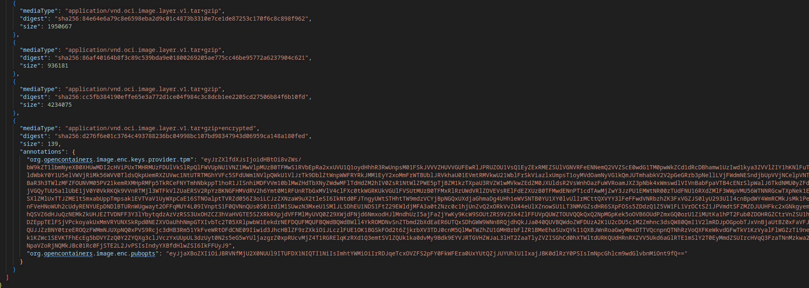

## OCICrypt provider for Trusted Platform Modules (TPM)

Basic [OCICrypt KeyProvider](https://github.com/containers/ocicrypt/blob/main/docs/keyprovider.md) for TPM 

This repo includes a prebuilt and customizable keyprovider which can be used to encrypt OCI Containers using a given TPM's `Endorsement Public Key (EKPub)`.

[OCICrypt](https://github.com/containers/ocicrypt) includes specifications to encrypt an OCI Container image and within that, the keyprovider protocol allows wrapping of the actual key used to encrypt the layer to an external binary.

The binary in this question accepts a keyprovider request and inturn perform two further rounds of envelope encryption where the innermost key is bound to the TPM.

Basically, TPM wraps the symmetric key that is used to encrypt the layer itself.

This sample is based off of the [simple-oci-keyprovider](https://github.com/lumjjb/simple-ocicrypt-keyprovider.git) repo which demonstrates the protocol involved.

For more information, see 

- [Advancing container image security with encrypted container images](https://developer.ibm.com/articles/advancing-image-security-encrypted-container-images/)
- [Enabling advanced key usage and management in encrypted container images](https://developer.ibm.com/articles/enabling-advanced-key-usage-and-management-in-encrypted-container-images/)
- [Container Image Encryption & Decryption in the CoCo project](https://medium.com/kata-containers/confidential-containers-and-encrypted-container-images-fc4cdb332dec)
- [OCICrypt Container Image KMS Provider](https://github.com/salrashid123/ocicrypt-kms-keyprovider)

`ocicrypt` comes with default support for [PKCS11 support](https://github.com/containers/ocicrypt/blob/main/docs/pkcs11.md) already and you are free to apply a [TPM PKCS-11](https://github.com/tpm2-software/tpm2-pkcs11).  However, the specific path used by the ocicrypt utilizes an RSA Public key associated to a key derived from the `Storage Root Key (SRK)`.  Its similar to [this](https://github.com/salrashid123/tpm2/tree/master/encrypt_with_tpm_rsa) procedure.

While using the PKCS interface should work, the child RSA key should be attested and associated with the specific TPM first (i.,e you need to do remote attestation and the AK needs to certify the child key).  You also need to install the PKCS module on the target system...which is a bit of a pain.

This repo on the other hand uses the `Endorsement Publickey (EKPub)` directly to wrap an inner encryption key which is itself encrypts the oci metadata for the container image.

Basically, its a bit easier to use the EKPub because its usually something you can derive from a TPM Public x509 certificate (`EKCert`).

If a user has the EKPub key, you can encrypt some data such that *it can only* be decrypted on that TPM alone (nowhere else).

Furthermore, you can stipulate that the decryption has to be bound to certain PCR values.

The specific encryption/decryption and binding is described in [Sealing RSA and Symmetric keys with TPMs](https://github.com/salrashid123/gcp_tpm_sealed_keys/tree/main#sealed-symmetric-key)

Anyway, this repo shows how you can encrypt some data with an EKPub anywhere and have it only decrypted on a specific TPM (presumably after the remote system attested and verified)

In the end, the image itself is encrypted as shown below (in this case, just the last layer was encrypted; you can encrypt all of them if you want)


>> NOTE: this code is not supported by google.  caveat emptor



---


#### Build

You can build the ocicrypt binary or grpc cserver directly from this repo or from the `Releases` section

```bash
cd plugin/
go build  -o /tmp/tpm_oci_crypt .
```

also install

* [skopeo](https://github.com/containers/skopeo/blob/main/install.md)
* docker
* [tpm2_tools](https://github.com/tpm2-software/tpm2-tools)
* [imgcrypt](https://github.com/containerd/imgcrypt.git)
* [nerdctl](https://github.com/containerd/nerdctl)

### QuickStart

First start `swtpm` and export the public PEM files

```bash
cd /tmp/
rm -rf myvtpm && mkdir myvtpm  && swtpm_setup --tpmstate myvtpm --tpm2 --create-ek-cert &&    swtpm socket --tpmstate dir=myvtpm --tpm2 --server type=tcp,port=2321 --ctrl type=tcp,port=2322 --flags not-need-init,startup-clear --log level=2

### in a new window
export TPM2TOOLS_TCTI="swtpm:port=2321"

### with EK
tpm2_createek -c /tmp/ek.ctx -G rsa -u /tmp/ek.pub 
tpm2_readpublic -c /tmp/ek.ctx -o /tmp/ek.pem -f PEM -n /tmp/ek.name
tpm2_flushcontext -t

### with H2
# printf '\x00\x00' > unique.dat
# tpm2_createprimary -C o -G ecc  -g sha256 \
#    -c /tmp/primary.ctx -a "fixedtpm|fixedparent|sensitivedataorigin|userwithauth|noda|restricted|decrypt" -u unique.dat
# tpm2_readpublic -c /tmp/primary.ctx -o /tmp/key.pem -f PEM -n /tmp/key.name
```

Then run a local registry

```bash
cd example/
docker run  -p 5000:5000 -v `pwd`/certs:/certs \
  -e REGISTRY_HTTP_TLS_CERTIFICATE=/certs/localhost.crt \
  -e REGISTRY_HTTP_TLS_KEY=/certs/localhost.key  docker.io/registry:2
```

The following will demonstrate encryption/decryption `skopeo` and a local docker registry

You will need [skopeo](https://github.com/containers/skopeo) for this sample

The sample below uses [swtpm](https://github.com/stefanberger/swtpm) and  [tpm2_tools](https://github.com/tpm2-software/tpm2-tools)

Decryption must be done on the same TPM where that ekPub exists.

First copy the `tpm_oci_crypt` binary onto the image and create an `ocicrypt.json` file that point to that


##### Configure ocicrypt plugin

First set an env var instructing skopeo on where to find the binary 

```bash
cd example/
export OCICRYPT_KEYPROVIDER_CONFIG=`pwd`/ocicrypt.json
```

where `ocicrypt.json` includes the `tpmURI` and path to the TPM (in this case the swtpm)

```json
{
  "key-providers": {
    "tpm": {
      "cmd": {
        "path": "/tmp/tpm_oci_crypt",
        "args": [
          "--tpm-path", "127.0.0.1:2321",
          "--tpmURI", "tpm://ek?pub=LS0tLS1CRUdJTiBQVUJMSUMgS0VZLS0tLS0KTUlJQklqQU5CZ2txaGtpRzl3MEJBUUVGQUFPQ0FROEFNSUlCQ2dLQ0FRRUFqOFoyRDdocDZoeHhhazhJUGRGdQpJcVJUd3NRQml5Z2ZSVTh0QXJtbXFrREhnYmQ1NlRzUkZSeGtHaFBNUG53V2pVZ1lMeW5yeFYwRHhaK1liRTZICjRkbVExVGxRbTlBSVV0TnFkeEJDcEhXZUJvUC96K215bHQySTV5dlJIYVR6Zlk4dWtTWjNnTk5RR0x6Z2xqZTMKek05N0JtZUtwUzVRSE9RWHZZTjM2WkNxZ0RoREx1eExyQkh5SnE0MDVpOUllT2kxU1pkZUdyK1A0T0QvaGFOcwpnVS9yd2M5UStEVzRnZWp6VVJJb3ovWVc4S09BSzZBTERXS0gvVWRTMWkvZUdvS3VsczhUczNOVkhEQ2ZyZVpCCnYvdHhnQnRaNWZaVWYvZ2RFczNFVlJyK1BSL0hGRGlsUHBQemRIUUE4RlBRckhHbjlZREZ4VDdFdFhvS0RKN1EKaFFJREFRQUIKLS0tLS1FTkQgUFVCTElDIEtFWS0tLS0tCg==&pcrs=MDowMDAwMDAwMDAwMDAwMDAwMDAwMDAwMDAwMDAwMDAwMDAwMDAwMDAwMDAwMDAwMDAwMDAwMDAwMDAwMDAwMDAwCg=="
        ]
      }
    },
    "grpc-keyprovider": {
      "grpc": "localhost:50051"
    }
  }
}
```

You can get the `tpmURI` by configuring it as such

```bash
cd example/
export EKPUB=`openssl enc -base64 -A -in /tmp/ek.pem`
export PCRLIST=`echo "0:0000000000000000000000000000000000000000000000000000000000000000" | base64 -w 0`

echo "tpm://ek?pub=$EKPUB&pcrs=$PCRLIST"

envsubst < "ocicrypt.tmpl" > "ocicrypt.json"
```

##### Encrypt

To encrypt an image, acquire the PEM format of the ekPub file from the certificate and the PCR value list you want to bind to.

First 
```bash
cd example/
export EKPUB=`openssl enc -base64 -A -in /tmp/ek.pem`
echo $EKPUB

export PCRLIST=`echo "0:0000000000000000000000000000000000000000000000000000000000000000" | base64 -w 0`
export USERPASS=""

export OCICRYPT_KEYPROVIDER_CONFIG=`pwd`/ocicrypt.json
export SSL_CERT_FILE=`pwd`/certs/tls-ca-chain.pem

# add to /etc/hosts
# 127.0.0.1 registry.domain.com

### now encrypt
skopeo copy --encrypt-layer=-1 \
  --encryption-key="provider:tpm:tpm://ek?pub=$EKPUB&pcrs=$PCRLIST" \
   docker://docker.io/salrashid123/app docker://registry.domain.com:5000/app:encrypted

### look at the file encrypted file
skopeo inspect  docker://registry.domain.com:5000/app:encrypted
```

```json
{
    "Name": "localhost:5000/ociencryptedapp",
    "Digest": "sha256:c7ec58f1cac9ba35544784174241e95224d05b8f804edd8b02812a794d14046b",
    "RepoTags": [
        "server"
    ],
    "Created": "2025-10-14T02:53:18.980326736-04:00",
    "DockerVersion": "",
    "Labels": null,
    "Architecture": "amd64",
    "Os": "linux",
    "Layers": [
        "sha256:dd5ad9c9c29f04b41a0155c720cf5ccab28ef6d353f1fe17a06c579c70054f0a",
        "sha256:960043b8858c3c30f1d79dcc49adb2804fd35c2510729e67685b298b2ca746b7",
        "sha256:b4ca4c215f483111b64ec6919f1659ff475d7080a649d6acd78a6ade562a4a63",
        "sha256:eebb06941f3e57b2e40a0e9cbd798dacef9b04d89ebaa8896be5f17c976f8666",
        "sha256:02cd68c0cbf64abe9738767877756b33f50fff5d88583fdc74b66beffa77694b",
        "sha256:d3c894b5b2b0fa857549aeb6cbc38b038b5b2828736be37b6d9fff0b886f12fd",
        "sha256:b40161cd83fc5d470d6abe50e87aa288481b6b89137012881d74187cfbf9f502",
        "sha256:46ba3f23f1d3fb1440deeb279716e4377e79e61736ec2227270349b9618a0fdd",
        "sha256:4fa131a1b726b2d6468d461e7d8867a2157d5671f712461d8abd126155fdf9ce",
        "sha256:01f38fc88b34d9f2e43240819dd06c8b126eae8a90621c1f2bc5042fed2b010a",
        "sha256:50891eb6c2e685b267299b99d8254e5b0f30bb7756ee2813f187a29a0a377247",
        "sha256:c4cd914051cf67617ae54951117708987cc63ce15f1139dee59abf80c198b74e",
        "sha256:ddc9bffd9ec055efa68358f5e2138ed78a2226694db2b8e1fb46c4ae84bae5ad",
        "sha256:b44fb5a747b4d3095aa18743ae27b4c911a6fe69f08539796a3fc14b22316666"
    ],
    "LayersData": [
        {
            "MIMEType": "application/vnd.oci.image.layer.v1.tar+gzip",
            "Digest": "sha256:dd5ad9c9c29f04b41a0155c720cf5ccab28ef6d353f1fe17a06c579c70054f0a",
            "Size": 83932,
            "Annotations": null
        },
        {
            "MIMEType": "application/vnd.oci.image.layer.v1.tar+gzip",
            "Digest": "sha256:960043b8858c3c30f1d79dcc49adb2804fd35c2510729e67685b298b2ca746b7",
            "Size": 20322,
            "Annotations": null
        },
        {
            "MIMEType": "application/vnd.oci.image.layer.v1.tar+gzip",
            "Digest": "sha256:b4ca4c215f483111b64ec6919f1659ff475d7080a649d6acd78a6ade562a4a63",
            "Size": 599551,
            "Annotations": null
        },
        {
            "MIMEType": "application/vnd.oci.image.layer.v1.tar+gzip",
            "Digest": "sha256:eebb06941f3e57b2e40a0e9cbd798dacef9b04d89ebaa8896be5f17c976f8666",
            "Size": 284,
            "Annotations": null
        },
        {
            "MIMEType": "application/vnd.oci.image.layer.v1.tar+gzip",
            "Digest": "sha256:02cd68c0cbf64abe9738767877756b33f50fff5d88583fdc74b66beffa77694b",
            "Size": 188,
            "Annotations": null
        },
        {
            "MIMEType": "application/vnd.oci.image.layer.v1.tar+gzip",
            "Digest": "sha256:d3c894b5b2b0fa857549aeb6cbc38b038b5b2828736be37b6d9fff0b886f12fd",
            "Size": 112,
            "Annotations": null
        },
        {
            "MIMEType": "application/vnd.oci.image.layer.v1.tar+gzip",
            "Digest": "sha256:b40161cd83fc5d470d6abe50e87aa288481b6b89137012881d74187cfbf9f502",
            "Size": 382,
            "Annotations": null
        },
        {
            "MIMEType": "application/vnd.oci.image.layer.v1.tar+gzip",
            "Digest": "sha256:46ba3f23f1d3fb1440deeb279716e4377e79e61736ec2227270349b9618a0fdd",
            "Size": 345,
            "Annotations": null
        },
        {
            "MIMEType": "application/vnd.oci.image.layer.v1.tar+gzip",
            "Digest": "sha256:4fa131a1b726b2d6468d461e7d8867a2157d5671f712461d8abd126155fdf9ce",
            "Size": 122108,
            "Annotations": null
        },
        {
            "MIMEType": "application/vnd.oci.image.layer.v1.tar+gzip",
            "Digest": "sha256:01f38fc88b34d9f2e43240819dd06c8b126eae8a90621c1f2bc5042fed2b010a",
            "Size": 5209711,
            "Annotations": null
        },
        {
            "MIMEType": "application/vnd.oci.image.layer.v1.tar+gzip",
            "Digest": "sha256:50891eb6c2e685b267299b99d8254e5b0f30bb7756ee2813f187a29a0a377247",
            "Size": 1889065,
            "Annotations": null
        },
        {
            "MIMEType": "application/vnd.oci.image.layer.v1.tar+gzip",
            "Digest": "sha256:c4cd914051cf67617ae54951117708987cc63ce15f1139dee59abf80c198b74e",
            "Size": 921781,
            "Annotations": null
        },
        {
            "MIMEType": "application/vnd.oci.image.layer.v1.tar+gzip",
            "Digest": "sha256:ddc9bffd9ec055efa68358f5e2138ed78a2226694db2b8e1fb46c4ae84bae5ad",
            "Size": 4156535,
            "Annotations": null
        },
        {
            "MIMEType": "application/vnd.oci.image.layer.v1.tar+gzip+encrypted",
            "Digest": "sha256:b44fb5a747b4d3095aa18743ae27b4c911a6fe69f08539796a3fc14b22316666",
            "Size": 135,
            "Annotations": {
                "org.opencontainers.image.enc.keys.provider.tpm": "eyJrZXlfdXJsIjoidHBtOi8vZWs/bW9kZT1lbmNyeXB0XHUwMDI2cHViPUxTMHRMUzFDUlVkSlRpQlFWVUpNU1VNZ1MwVlpMUzB0TFMwS1RVbEpRa2xxUVU1Q1oydHhhR3RwUnpsM01FSkJVVVZHUVVGUFEwRlJPRUZOU1VsQ1EyZExRMEZSUlVGNVduSmhaMll3ZVNzMGVIVjFUSHA1V0ZoeU5ncDROVlZOVDA5SWQxVjVlbWNyU201NlMzVXpTRFphVTBZNE4wbFNabHBzYVdFelFXWkRaa1pFVFc5alNrMXVSV2xFVm1GMGJGSlpaRVJOWldoSGVHZHdDbWcxZWxKVVV6SnhZeTlxZVdGVVFXUlJkalUyZFhSdVduRkpka2hDWmtwb1YyaE1ZV0o1VkdjNE5UQm9WRWRsT0RCM09YQTVXRWMxYldFeU0ydFRiaXNLY1ZoSFVsSlNiM1J6ZEdGSWExUXJURnBCYm10bVdsQTBOMnhIVmtaUFdIbHZiVEVyUkVKV2VrczRaVk5KUlRoM2FHcFlUbTR4VFZWdU16RTRiVEZ6VkFwMk5rSXhkbVZOZUZSNVRHeDBkMFYzVUdKcGEzQTVWRXhzUVU5bmFHNTJObkYwVlRab1ZIVktRazFVU1VZek5FZDVUVWMyTUhFNU5GTktValZHZFU1M0NqSlBNR1pWYW1aUlRHeG5lVGt4WTI5TFkwdGlaMjRyT0U4eE5sbE1iRXRFZVZoRmNHVTBaalJDYlV4dFQyMTNVWFpPYTFKeFduRkJTRUp5VFdsNmJXa0tUbmRKUkVGUlFVSUtMUzB0TFMxRlRrUWdVRlZDVEVsRElFdEZXUzB0TFMwdENnPT1cdTAwMjZwY3JzPU1Eb3dNREF3TURBd01EQXdNREF3TURBd01EQXdNREF3TURBd01EQXdNREF3TURBd01EQXdNREF3TURBd01EQXdNREF3TURBd01EQXdNREF3TURBd01EQXdDZz09XHUwMDI2dXNlckF1dGg9Iiwic2Vzc2lvbl9rZXkiOiJleUpqYVhCb1pYSjBaWGgwSWpvaWNHOW5aVUY0TkRKT1JIVk5TRzlvYW1WMVZESmhVVFJtWkRnd2VVVkZhMUJQYzNncmFFMHZRbkZ2V0hFNVlXbFRWRWxsZUZNeGRqVk1WVE0zV0dWNlR5SXNJbWwySWpvaWRYUlNZMlV4ZDI1TlYzaDFiVkowTWlJc0ltdGxlVWx1Wm04aU9uc2liV1ZqYUdGdWFYTnRJam9pTVNJc0luZHlZWEJ3WldSTFpYa2lPaUpsZVVveVdsaEtlbUZYT1hWSmFtOTVURU5LTUdWWVFteEphbTlwVWtaV1VWUkZiRVJSVmxKR1NXbDNhV05IVG5samVVazJWek56YVdSdFJuTmtWMVZwVDJsS1FsRlZSa0pSVlVaQ1VWVkdRbEZWUmtKUlZVWkNVVlZHUWxGVlJrSlJWVVpDVVZWR1FsRlZSa0pSVlVaQ1VWVkdRbEZWUmtKUlZVWkNVRk5LT1ZoVGQybGFTRlozWWtkc2FsbFlVbXhhUlRsM1NXcHdOMGx0ZEd4bFYxcHdZa2RWYVU5cFNYUk1VekIwVEZWS1JsSXdiRTlKUmxKVVZYcEpaMVZHU2twV2EwWlZVbE5DVEZKV2EzUk1VekIwVEZaNGRWUlZiRXBSTTBKQ1YxVmtZVTVGVmtkUk1tUkdVbGM1UWxSVlNrSmFhWFJ2V2pKT1NtUXlaR2xQU0dSUFkxVkdSbEZYWkVwUmJWa3lVbGhXUTFFelpFSlRWV1JoWWpKV2VFMTZVbHBqYWtWNldXdHJkbEZzZUhWaFZGRXlXbTF3Y0ZGVmJITmxSazVIV1c1V1NtVnVUVEZSV0VaWVZXcENUMWRJYkhKaVJVWkNVVlZHUWxWVlJrMVJXR1JHVVZWR1JWRllhSFpSVmtaRVVWZGtTRk5YT1ZSaE1GWkxaREJHUWxGVlRrcFJWbmgxVVhwS2IyTnJOVE5QUldjeVYyMVNjbUp0WkV0Vk1rWlhWbXBLTmxWdWJGSldWbWd4VjIweFEyTnViRE5UTWpWdlRWZFZOVlZYUmt0V1NFNUNVa1ZLVkdJd1JsSlJNRVp1VW01b2RsWlhPVVpWTUVaQ1VWWjRkVkZWUmtwUlZXeENZWHBuTWsxRlZscFRSbFpzVVZkc1NGUkdhSE5TTUhCMlRqSXhkbGRIT1ZKT1JHeElUVEl4TmxOVVJraFBSbG94VlhsMGVWUjVPVE5SVlU1RFVtMTBORXN3UmxWWFJUbEhZVVpPZGxWV2VIVmpXRkpzVFRCS2NrOVZiRmROUlhSUVlVWkdVV1JXVm5oT01VNHlWVlZTTVU1VlJtbGhla0pvVXpCT1FsVldiRVphTW1SR1VUQkdVbEZ0YUZwWGJVWXlVa2hLYlZOclJsUlRlbEoxVGpCR2FHRnJSakZqYkhoMVkxVnNRMDVFUVRGTU0xWlhVbXhyZDA5WGVETmxWMnQ2VWtaWk5GcEViRTFrVm1oT1QxZGtlVlJYVmtaWFJUbFJVVlpvV1ZORVZrVlpiV2hOVGxaT1dHRXlUakJTYkVadVVrZFNVRmR0ZUd0bGJrcEVUa1o0ZFdOclJrbFhibVJSVm1wc1RtSXlVblpXVlRnMFUxaHNObFpWT0ROUlZYaFlVbFZOTW1NeFVUTk9SV2hKVlhwU2NXRnJiekJhYm1NMVVWWkdjMkpWT1ZwbGJYUm9UMWMxTmxWVGREQlNla0p5WWpOU2VVMHhlSFZTVldjeVdtdGFTRTFXY0c5U01tZDNWMjFLYVdSSGJFSlVSVko0Wkd0U05tTlhOWHBsU0VwRlkwWkplV013VW5kbFdHc3dZVE5HYmsxRldsSlZSekIyVDBVeFVtSnRPSFpOZVhNeVRWaG9kVTlFU2tsUk1YaDFaVWhHV2xvd2FGWmFiVEZ2V21zeFEyVkZXa3RXVnpVeVkyczVhRTVJY0ZsVmJHeHZZakF4TUdOVk1VZFdlbEpHVFVoQ1lXVkZiRzFpUnpWWVRUTkNXazVJVm1oTmFrcDBZVlphUWxOc1RuZFZSbXhyVkZaNGRVOUZhR3RsYm14NVRURmtkRkV3Y0VKa2FUaDVWa1JWZDFSVlRsUmhXRzkyVGpBd05GcHJOWEppVm14UVVsVmtNMDlGU2toa2JscEVXak53TTFadGJHbFZhM2hOVWtkNFNGcDZUa3BVZVRoNlRucHNjbFpzZUhWUlYyUlRVVlZHUWxKclJrTlNhMFpDVmtka1FsTlZSa0pqTUVaQ1VWVkdRbEZWVGtOYWVUZ3daRWRhVms0eFkzZE5hbVJ6VG10Sk5XTkZaRTlQU0dod1kydDRjVk13YkdGU1IzaHRUak53ZWxwdE1VMU9SbmgxVFZSc1NrNXVXak5SVmtaQ1VUQk9jMk13YUc5TmFsSnlUbFZPV1dKRmRGcGFiRnBVWld4QmVGcEZVbTVWUlhNMVZUSnNkMVl4VmxKVVNHeHNVak53ZFZkRmVIVlRNMEpTVlc1V1FsSXpaRUpUVlUxNlRqRjRkV0l4UWt4a2EzUXpXV3RuTTFKRlNsQk9NVkp6V2taYVdWTllhRlJhTVdSVVdUSnNVMU5WVm5oVWVtaExVbGR2TTJGWGFFTmFiVVo0VlRJeFZtVnRhRXhSYlVrMFpWTTVhMkV3Y3pGVGExSlJVakJzVFZveGVIVmhSVlUxWWxkb2RWZEhOVFpqVlZVellsZFZORXd4YkVkVmFrWkhURE5hUlZRd1dYSmliRXBOVmpKV1MxTlVWbkZQUmxwV1ZrWlJlRXd5TldsU01ERjVUbWwwY1ZKRVFsbGFWRkY2VTFaV05GZHVhSFpXYkhoMVVXMDRja3N3ZHpOV1IxWjRaVlZyT1ZoSE5IUk1VekIwVEZWV1QxSkRRbFZWTVUxNVNVWkNVMU5XV2tKV1JWVm5VekJXV2t4VE1IUk1VekZqWW1sSmMwbHVRbWhqYlZaMVpFVTFhR0pYVldsUGFVbDNUVVJDYVU1cVp6SlphazB6VFVkWmQwNHlWVFZQVkdNeVRrUnNiRTFFU1RGTmFsazFUbFJWTTA1dFRtdE5WMDAxVFVSVmVFNHlTVFZQVkdzMFRWZEdiVTF0VFhkWlZHeHNUVmRSTVZwWFdURk5SRmswVDFSU2JGbDVTWE5KYlZaeVkwaFdhVWxxYjJsVVZ6RlNaVlp3UlZOdGRFNWlWa1kxVjJ0U1VtVlZOVVZXVkVKUFpXeEZNVlJyWkZabFZURkZWbGhrVDFaR1ZYZFVWM0JUWVdzMVJXRjZRazVsYTJ3elZHdGtTazFGTlZWV1ZGWk9ZbFpHTlZkclVrdGhNREYwVlZoc1lWSkZTbTlVYTJSU1RVVTVWVlZVVms5U1JXdDNWREZTWVdGRk5VVlNWRUpoVmtaR05WUnRjR3BOYkd4eFdUTm9UMkZ0WTNsWFYzQmFUbFUxUlZremNGQldSMDE2VkZod1FrMUZNWEZWV0doUFZrVlZkMVJzVWxKTmF6VkZVbFJDVGxaR1NuUlVhMUpPVFVVeFZWWllhRTVsYldOM1ZGWlNVMkV3TlVWaGVrSlFWa1pHTlZSclVrNU5helUyVlcxc1QxSkZNSGRVVmxKV1pVVTFSVlpVUWs1V1IwMHhWR3hrUmswd01YRlhXR2hQWVcxTmVWUnRjRTVrTURVMllUTnNXbUZyTUhkVWJuQnVUVEExVlZsNlJrOVNNREI2VjFaU2FrNVZOVlZhZWtaUVVrZE9OVlJZY0Zwa01XeFZXWHBTVG1Wc1ZYaFViRkpUWVRBMVNGZFVRbUZoYkVVd1ZHNXdhazFWTlZWWmVsWlBUV3RWZVZSdWNFdGhWVFZJVWxSS1lWWkhVbTlVYTJSS1RUQTFWVlJZY0U5U1IyUTJWRzF3VjJGRk5WVlVWRUpQWVdzd01GUlljR3BOUlRsVlZsaHNUMkZzYTNoWFZsSmhZV3MxY1dGNlNrNVdSVEUyVkd0U1JrMXJOWEZWV0hCUFlXeHJkMVJ0Y0ZKTlJUVklWVlJLWVdGc2JEWlVhMlJHVFVad1JWZHRlRTlTUmxWNVZERlNVazFGTlZWWFZFcE9Wa2ROZDFSdE1VNU5WVEZ4VmxSV1QyRnNSWGRVYTFKVFlUQTFjVlpVU2xCU1JrVjZWRzV3Ymsxck5UWlpNMlJPVWpCVmVWUXdVazVOVlRSNVVsUkdUbUZzVlhkVWJGSk9aV3N4Y1ZremFFOWhhekUxVjIxd1lXRkZOVFpoZWtwT1ZrWlZkMVJyVWtaTmF6VkZWbGhvVDJWc2JEWlViRkpPVFdzMU5sWlVUazlTUm5CelZHeGtSazB3TVZWVlZGWlBaV3hyZDFRd1VsSmxWVFZ4VjFSQ1dsWkdhekJVYkZKcVRXczVSVlZ0Y0U5aGExVjVWRmR3YWs1Vk5WVlZWRXBQWldzd01GUlljRlpsYXpGRlYxUlNUMVpHUlhkVWJuQmFUVlV4TmxvemNFNVNSMDE2VkZod2NrMHdNVVZVVkZaUFZrZGpkMVJ1Y0U1TlZUVjBWVlJLVGxaRk1UVlVXSEJPVFd4c2NWWlljRTlpVmxZMVYxZHdRMkZGTlRaU1ZFWlFVa1pGZWxSc1VrcE5WVEZ4Vmxoc1QySldhM3BVYTFKcVpXczFObFZVU2s1V1JrVXdWRzB4U2sxVk5VVlRiV3hQVWpBd2VGZFdVbEpsUlRWMFZsUktXbUZzYTNsVWJHUkdUVlV4UlZSVVFrNWxiVTE1VjFod1VrMHdOVlZYVkVKUFlXeEtkRlJzVW01Tk1EbFZWMjB4VDJKV1JqWlVWbEpMWVZVMVJWVlVRazVoYkZWNVZHcEtSazFHYkhGVVZGSlBZV3hWZUZSWWNGSk9WVFZGVmxod1VGSkhUWHBVYlhCdVRXeHNWVlpVVWs5U01WVjVWMnhTVG1WRk5VaFZWRVpQVmtad2MxUlljRTVsYXpGVlZGUlNUMkpXUmpaVVZsSnFaV3MxVlZWWVpGcFdSMDE1VkZod1drMUZNWEZVV0doUFpXeHJlVlJzVWxOaE1EVTJXbnBHVDFKSFRURlVhMlJPVFd4c05sbDZRazlsYlUxM1ZHeFNhazB3TlZWUlZFcE9ZV3hyTVZSdE1VcE5NREZGVkZSV1QxWkdSWGRYV0hCaFlXczFSVkpVUW1GaGJHdDZWRzF3Ymsxc2NGVlpla3BPWld4cmVsUldVbXBOUlRWVlZsaHdUMkZzYXpCVWJGSlNUVEExVlZWdGFFOVNSV3QzVjJ0U1ZrMUZOVVZoZWtKUFlXc3hObFJZY0ZKTlJUVTJXWHBXVDFJeFJYZFVibkJPVFdzeE5sRlVUazVXUlRBeFZGaHdVazFWTVRaVmJXaFBWa1ZzTmxSc1VsSk5helUyVmxSQ1lWWkhUWHBVVldSR1pXc3hjVlZ0TVU1bGEwVjVWRzF3VmsxVk5YUlNWRXBQWVd4V05GUnJaRTVOYkd3MlYxUk9UMlZ0ZERaVU1WSk9aVVUxY1ZSVVNtRmhiRXB3Vkcxd1RrMUdiSEZYV0d4UFlXMU5lVmRzVWt0aFZURTJXbnBDWVdGck1UUlVXSEJhVFZVNVZWVnRjRTlpVlRCM1YxZHdVazFGTlRaaGVrWlFVa1pGZUZSdWNFSk5helZWVkZSQ1QyRnNiRFpVYTFKU1pWVTFkRlZVUWxwbGJIQnlWR3RrV2sxc2NFVlplazVQVmtWVmVsUnRjRk5pUlRWMFUxUkdUbUZ0VGpSVWJHUkdUVEF4VlZWWWFFOVNSMk4zVkZkd2FtVlZOVWhWVkVwUVZrZFNiMVJ0TVZKTmF6bFZVVzFvVDFJeFZYcFVibkJTVGxVMVJWVlVRazVXUmxZMFZHdFNSazFGTVhGUmJXaE9ZbFpHTlZkclVrdGhNREYwVlZoc1lWSkdSWGhVYTJSV1RVVTFSVk5ZWkU5V1JVVjRWR3hTVW1WVk5VaFVWRUpRVmtaR05sUlhjRUpOUm14eFZWUkdUMVpIZERWWGExSkxZVEF4ZEZWWWJHRlNSWEJ5VkZWa1JsQlRTamxtVVQwOUluMTkiLCJ3cmFwcGVkX2tleSI6ImNQSlJvU0drcnVxZlFBVUtVUmRCZjAwd2NLSENiSFhOaGM1SENIVm1jTFRvVnUvUkRwbHh1Z295Smc5aDN4Nk5TV0NaOUc3b2J1K3lSa0tNZHhvandjUStzLzlyY1NGOFZSZk1CZDl4SkducFJSVEs0TWdmbzQzNEdYQVF1bGtTWWJieU5BaHA0U05PQ28yOVlsd3FDb0ROemQwaE1URzhWTmJJZGtRRXlDWXVlYVZmZXI3akxZbkZweFl3WStoRXZabjBFTStpaE5hTE8xMklDTXgxeklOalJJWXRUWStoYmZjVTVkbFJOK29CRXNIMFJISi9BOHZyTnpuR1p0dDk1Nml6RGhkbmxqV2hFVlVqZVU5bXE2d1BDQStUY2pPMU9pUGRuZEk9Iiwid3JhcF90eXBlIjoiQUVTIn0=",
                "org.opencontainers.image.enc.pubopts": "eyJjaXBoZXIiOiJBRVNfMjU2X0NUUl9ITUFDX1NIQTI1NiIsImhtYWMiOiIrL2FneTI3U1EvMHhvZ1BXQ3lTRE82Q2NMWUw3YXovMWhGVjBvU0NYaUdzPSIsImNpcGhlcm9wdGlvbnMiOnt9fQ=="
            }
        }
    ],
    "Env": [
        "PATH=/usr/local/sbin:/usr/local/bin:/usr/sbin:/usr/bin:/sbin:/bin",
        "SSL_CERT_FILE=/etc/ssl/certs/ca-certificates.crt"
    ]
}
```

if you decode the key:

```json
{
  "key_url": "tpm://ek?pub=LS0tLS1CRUdJTiBQVUJMSUMgS0VZLS0tLS0KTUlJQklqQU5CZ2txaGtpRzl3MEJBUUVGQUFPQ0FROEFNSUlCQ2dLQ0FRRUF5WnJhZ2YweSs0eHV1THp5WFhyNgp4NVVNT09Id1V5emcrSm56S3UzSDZaU0Y4N0lSZlpsaWEzQWZDZkZETW9jSk1uRWlEVmF0bFJZZERNZWhHeGdwCmg1elJUUzJxYy9qeWFUQWRRdjU2dXRuWnFJdkhCZkpoV2hMYWJ5VGc4NTBoVEdlODB3OXA5WEc1bWEyM2tTbisKcVhHUlJSb3RzdGFIa1QrTFpBbmtmWlA0N2xHVkZPWHlvbTErREJWeks4ZVNJRTh3aGpYTm4xTVVuMzE4bTFzVAp2NkIxdmVNeFR5TGx0d0V3UGJpa3A5VExsQU9naG52NnF0VTZoVHVKQk1USUYzNEd5TUc2MHE5NFNKUjVGdU53CjJPMGZVamZRTGxneTkxY29LY0tiZ24rOE8xNllMbEtEeVhFcGU0ZjRCbUxtT213UXZOa1JxWnFBSEJyTWl6bWkKTndJREFRQUIKLS0tLS1FTkQgUFVCTElDIEtFWS0tLS0tCg==&pcrs=MDowMDAwMDAwMDAwMDAwMDAwMDAwMDAwMDAwMDAwMDAwMDAwMDAwMDAwMDAwMDAwMDAwMDAwMDAwMDAwMDAwMDAwCg==",
  "session_key": "eyJjaXBoZXJ0ZXh0IjoicG9nZUF4NDJORHVNSG9oamV1VDJhUTRmZDgweUVFa1BPc3graE0vQnFvWHE5YWlTVElleFMxdjVMVTM3WGV6TyIsIml2IjoidXRSY2Uxd25NV3h1bVJ0MiIsImtleUluZm8iOnsibWVjaGFuaXNtIjoiMSIsIndyYXBwZWRLZXkiOiJleUoyWlhKemFXOXVJam95TENKMGVYQmxJam9pUkZWUVRFbERRVlJGSWl3aWNHTnljeUk2VzNzaWRtRnNkV1VpT2lKQlFVRkJRVUZCUVVGQlFVRkJRVUZCUVVGQlFVRkJRVUZCUVVGQlFVRkJRVUZCUVVGQlFVRkJRVUZCUFNKOVhTd2laSFZ3YkdsallYUmxaRTl3SWpwN0ltdGxlV1pwYkdVaU9pSXRMUzB0TFVKRlIwbE9JRlJUVXpJZ1VGSkpWa0ZVUlNCTFJWa3RMUzB0TFZ4dVRVbEpRM0JCV1VkYU5FVkdRMmRGUlc5QlRVSkJaaXRvWjJOSmQyZGlPSGRPY1VGRlFXZEpRbVkyUlhWQ1EzZEJTVWRhYjJWeE16UlpjakV6WWtrdlFseHVhVFEyWm1wcFFVbHNlRk5HWW5WSmVuTTFRWEZYVWpCT1dIbHJiRUZCUVVGQlVVRk1RWGRGUVVGRVFYaHZRVkZEUVdkSFNXOVRhMFZLZDBGQlFVTkpRVnh1UXpKb2NrNTNPRWcyV21ScmJtZEtVMkZXVmpKNlVubFJWVmgxV20xQ2NubDNTMjVvTVdVNVVXRktWSE5CUkVKVGIwRlJRMEZuUm5odlZXOUZVMEZCUVZ4dVFVRkpRVWxCYXpnMk1FVlpTRlZsUVdsSFRGaHNSMHB2TjIxdldHOVJORGxITTIxNlNURkhPRloxVXl0eVR5OTNRVU5DUm10NEswRlVXRTlHYUZOdlVWeHVjWFJsTTBKck9VbFdNRXRQYUZGUWRWVnhOMU4yVVVSMU5VRmlhekJoUzBOQlVWbEZaMmRGUTBGUlFtaFpXbUYyUkhKbVNrRlRTelJ1TjBGaGFrRjFjbHh1Y1VsQ05EQTFMM1ZXUmxrd09XeDNlV2t6UkZZNFpEbE1kVmhOT1dkeVRXVkZXRTlRUVZoWVNEVkVZbWhNTlZOWGEyTjBSbEZuUkdSUFdteGtlbkpETkZ4dWNrRklXbmRRVmpsTmIyUnZWVTg0U1hsNlZVODNRVXhYUlVNMmMxUTNORWhJVXpScWFrbzBabmM1UVZGc2JVOVplbXRoT1c1NlVTdDBSekJyYjNSeU0xeHVSVWcyWmtaSE1WcG9SMmd3V21KaWRHbEJURVJ4ZGtSNmNXNXplSEpFY0ZJeWMwUndlWGswYTNGbk1FWlJVRzB2T0UxUmJtOHZNeXMyTVhodU9ESklRMXh1ZUhGWlowaFZabTFvWmsxQ2VFWktWVzUyY2s5aE5IcFlVbGxvYjAxMGNVMUdWelJGTUhCYWVFbG1iRzVYTTNCWk5IVmhNakp0YVZaQlNsTndVRmxrVFZ4dU9FaGtlbmx5TTFkdFEwcEJkaTh5VkRVd1RVTlRhWG92TjAwNFprNXJiVmxQUlVkM09FSkhkblpEWjNwM1ZtbGlVa3hNUkd4SFp6TkpUeTh6TnpsclZseHVRV2RTUVVGQlJrRkNSa0ZCVkdkQlNVRkJjMEZCUVVGQlFVTkNaeTgwZEdaVk4xY3dNamRzTmtJNWNFZE9PSGhwY2t4cVMwbGFSR3htTjNwelptMU1ORnh1TVRsSk5uWjNRVkZCUTBOc2MwaG9NalJyTlVOWWJFdFpabFpUZWxBeFpFUm5VRXM1VTJsd1YxVlJUSGxsUjNwdVdFeHVTM0JSVW5WQlIzZEJTVU16TjF4dWIxQkxka3QzWWtnM1JFSlBOMVJzWkZaWVNYaFRaMWRUWTJsU1NVVnhUemhLUldvM2FXaENabUZ4VTIxVmVtaExRbUk0ZVM5a2EwczFTa1JRUjBsTVoxeHVhRVU1YldodVdHNTZjVVUzYldVNEwxbEdVakZHTDNaRVQwWXJibEpNVjJWS1NUVnFPRlpWVkZReEwyNWlSMDF5Tml0cVJEQllaVFF6U1ZWNFduaHZWbHh1UW04ckswdzNWR1Z4ZVVrOVhHNHRMUzB0TFVWT1JDQlVVMU15SUZCU1NWWkJWRVVnUzBWWkxTMHRMUzFjYmlJc0luQmhjbVZ1ZEU1aGJXVWlPaUl3TURCaU5qZzJZak0zTUdZd04yVTVPVGMyTkRsbE1ESTFNalk1TlRVM05tTmtNV001TURVeE4ySTVPVGs0TVdGbU1tTXdZVGxsTVdRMVpXWTFNRFk0T1RSbFl5SXNJbVZyY0hWaUlqb2lUVzFSZVZwRVNtdE5iVkY1V2tSUmVVNUVWVEJPZWxFMVRrZFZlVTFFVlhkT1ZGVXdUV3BTYWs1RWF6Qk5la2wzVGtkSk1FNVVWVFZOYlZGNVdrUkthMDF0VVhsYVJFSm9Ua2RSTUU5VVVUVk9SRWt3VDFSYWFFNUVSVEJhVkZGNVRtcGpNbGxxWTNoT2FtY3lXV3BaTlU1RVkzcFBWR016VFhwQk1FMXFVWGhPVkVVd1RsUlJNazVFUlRCTlZGSnRUa1JOTUUxVVZYaE5lbWN3VFZSU2EwNUVhekJQVkZGNVRrUk5NazU2VW1sT1JFMHdUVlJWZUU1RVZUQk5WR00xVGxkRk0wMXFXWGhPYW1NeVRtcE5kMDU2YTNsWmFrMHdUbnBuTTA1VVl6Rk9SMDB6V1ZSak5VNVVaekZQUkdONVRYcFpkMWxVWXpSTmVsVXhUbFJTYTA1SFdUQmFhbEUwVG5wak1VNVVZelZPTWtVeVRucEthVTVIUlRKYVZHUm9Ua2RKTTA1VVRYcE9SR2Q2VG1wV2FFNVVUVEJPYWswMFRYcGpNRTlVVlhsT2Fsa3hXVlJhYWs1cWF6Sk5WRTE2VGtSRk1rNXFVWHBPYWxrd1RtcFJNRTVIVVRKYWFsbDZUa2RGTUZwRVdteE9SRlV5VDFSUk1FNVVXVEpOVkdNd1RtMU5NVTFxVlRWT2FsRXdUa1JTYTA1cVZUSlBSRkV6VG5wbk1rNTZZM2ROUjBVeVQwUk5NVTR5UlRGTmFsVXdUbFJOZWsxcVkzaE9hazE1V21wYWFFNTZhekpOVkZVd1RrUkZNazVFVlhoT2VsbDZUbFJOTWs1NlZUTk9SRnBzVGxkRk0wMVVVVFZPZWxrd1QwUlJlVTVxV1RCWlZGazBUbFJqTWs5RVVtcE9ha1V5VFdwak5VNVVVVEpPZWswMFRYcFZlazFFV1RST1ZGRXdUbnBaTVUxNlozcE5SR016VFhwck0wMUVUVFZPVkdjd1RucE5NVTV0VVRKTlZFMTVUWHBOTWxscVZYcE9iVlY1V1dwQ2FFNTZSVEZQUkZFelRsUkpNVTFxVlhsT2JWa3pUa1JqZWs1NlVUSk5WRkUwVG0xSk1VNUVTbWxPUjAweFdWUlJlRTV0VlRKWmFsa3lUbGRGTVUxRVRUQk5lbU15V1hwUk0wNVVXVEJPYWxKdFRsUm5NMDlVV20xT2JWRjZUVlJLYVU1RVVUQk5hbFV5VGpKRk1GbHFUVFJPYWxVeFRYcFJOVTVFVlhwUFJHTXpUbXBuTWxsVVZUUk9SMVV5V2xSTmVFNUhVVEZPVkZwc1RYcE5lazFVVFRST2JWRjZUVlJqZWs1VVVYZFpWR015VFhwWk1FMXFUWGhPZWxreVRsUlNhMDU2WnpGT1JHTTFUa2ROTWxsNll6Qk9lbU13VGxSak0wNVVRVEpOYWxrMVRtMUpNMDFFVFRWT1ZGRXdXWHBhYWs1RVJUQmFhbGt6VG1wbk1scFVZekpOZWxrelRWUmpNRTVVVlhwT2FsazBUbFJSTTA1VVVtaE9SRWt3V2tSVk1FNUVhekJPYWsxNlRYcFJNRTU2WXpWT1IxRXdUbnBOTWsxNlFUTk5WRTAxVFhwUk1VMTZVbWhPVkVsNlRsUlJNazU2VlRCYVZHTXpUVWRGZWsxcVVtMU5la0V5VG1wVk1VNXRSVEpPYWxWNFRrZE5NbGw2V1ROT2VtdDZUMVJOZUU1cVRUSmFhbEpwVG1wTk1GbHFXWGxPYW1NeVdsUkthVTE2WnpCYWFrMTRUWHBaTVU5VVVtcE9iVTB3V1dwUk1FNTZhekZQUkZFeFRucEJNazVVVFRCT2FsbDZUa1JSZVU1dFVUQlplbHByVGtkWk1scEVZek5PVkVVelRtcFNiRTV0U1RGTmFtTjRUbGRGTTAxVVVYaE9SR2N3VFdwamVVNUhVVEpQVkdSb1RtMVJNazlVUW1oT1IxVXpUbnBSTlU1RVVUQk5WRlY0VGtSRk1FMXFRbWhOYlZGNVdrUkthMDF0VVhsYVJGRXhUa2RWTUU1RVNYZE9WRUV4VGxSUmVVNUhUVEJQVkZGNlRXcEJNRmxxVVRGT1ZHdDVXa1JLYTAxdFVYbGFSRXByVFVkRlBTSjlmUT09In19",
  "wrapped_key": "cPJRoSGkruqfQAUKURdBf00wcKHCbHXNhc5HCHVmcLToVu/RDplxugoyJg9h3x6NSWCZ9G7obu+yRkKMdxojwcQ+s/9rcSF8VRfMBd9xJGnpRRTK4Mgfo434GXAQulkSYbbyNAhp4SNOCo29YlwqCoDNzd0hMTG8VNbIdkQEyCYueaVfer7jLYnFpxYwY+hEvZn0EM+ihNaLO12ICMx1zINjRIYtTY+hbfcU5dlRN+oBEsH0RHJ/A8vrNznGZtt956izDhdnljWhEVUjeU9mq6wPCA+TcjO1OiPdndI=",
  "wrap_type": "AES"
}
```

Note the last layer is encrypted; you can encrypt all the layers if you want

##### Decrypt

To decrypt, just specify the mode

```bash
skopeo copy  --decryption-key="provider:tpm:tpm://ek?pub=$EKPUB&pcrs=$PCRLIST" \
    docker://registry.domain.com:5000/app:encrypted docker://registry.domain.com:5000/app:decrypted

skopeo inspect  docker://registry.domain.com:5000/app:decrypted
```

If you wanted to use an H2 image
```bash
export H2PUB=`openssl enc -base64 -A -in /tmp/key.pem`
echo $H2PUB

skopeo copy  --encrypt-layer=-1 \
  --encryption-key="provider:tpm:tpm://ek?pub=$H2PUB&pcrs=$PCRLIST&parentKeyType=H2" \
   docker://docker.io/salrashid123/app docker://registry.domain.com:5000/app:encrypted

skopeo copy  --decryption-key="provider:tpm:tpm://ek?pub=$H2PUB&pcrs=$PCRLIST&parentKeyType=H2" \
    docker://registry.domain.com:5000/app:encrpted docker://registry.domain.com:5000/app:decrypted
```

Note on using OCICrypt:  the image that is decrypted ...is decrypted so anyone who runs the command above can 'just copy' the image somewhere else, unarmored.  

---


##### PCR policy

For the PCR value, its encoded as comma-separated string of `PCR#=base64(lower(pcrvalue))`:

```bash
# 0=d0c70a9310cd0b55767084333022ce53f42befbb69c059ee6c0a32766f160783
## so for me it was encoded as
## export PCRLIST=`echo -n "0=d0c70a9310cd0b55767084333022ce53f42befbb69c059ee6c0a32766f160783" | openssl enc -base64 -A -in -`
export PCRLIST="MD1kMGM3MGE5MzEwY2QwYjU1NzY3MDg0MzMzMDIyY2U1M2Y0MmJlZmJiNjljMDU5ZWU2YzBhMzI3NjZmMTYwNzgz"
```

TODO: passwword policy

---


### Setup gRPC OCI KMS provider

Included in this repo is a grpc service which you can use as the key provider.

Basically, its the same as calling the binary except that it calls a gRPC server you run separately.

Note, the existing implementation _does not use TLS_!.  You would definitely want to secure access to this service.

To use, start the server

```bash
cd grpc/

go run server.go --tpm-path="127.0.0.1:2321" --tpmURI="tpm://ek?pub=$EKPUB&pcrs=$PCRLIST"
```

set the `OCICRYPT_KEYPROVIDER_CONFIG` file to use

```json
{
  "key-providers": {
    "tpm": {
      "cmd": {
        "path": "/path/to/tpm_oci_crypt",
        "args": []
      }
    },
    "grpc-keyprovider": {
      "grpc": "localhost:50051"
    }
  }
}
```

Finally invoke the endpoints (note `provider:grpc-keyprovider` is used below)

```bash
cd example/
export SSL_CERT_FILE=`pwd`/certs/tls-ca-chain.pem

skopeo copy --encrypt-layer -1 \
  --encryption-key="provider:grpc-keyprovider:tpm://ek?pub=$EKPUB&pcrs=$PCRLIST" \
    docker://docker.io/salrashid123/app docker://registry.domain.com:5000/app:encrypted

skopeo copy   --decryption-key="provider:grpc-keyprovider:tpm://ek?pub=$EKPUB&pcrs=$PCRLIST"  \
      docker://registry.domain.com:5000/app:encrypted docker://registry.domain.com:5000/app:decrypted
```


### Using containerd


To use `containerd` can decrypt and run the image automatically, you first need to configure a stream processor pointing to the decryption functions.

Basically, when containerd detects an encrypted image, it will expect an external process to provide the decrypted image layer.

To do this, we will need [imgcrypt](https://github.com/containerd/imgcrypt.git) installed as well.


First configure `ocicrypt.json` to include the `tpmURI`

```bash
cd example/
export OCICRYPT_KEYPROVIDER_CONFIG=`pwd`/ocicrypt.json
export SSL_CERT_FILE=`pwd`/certs/tls-ca-chain.pem
```

- `ocicrypt.json`:

```json
{
  "key-providers": {
    "tpm": {
      "cmd": {
        "path": "/tmp/tpm_oci_crypt",
        "args": [
          "--tpm-path", "127.0.0.1:2321",
          "--tpmURI", "tpm://ek?pub=LS0tLS1CRUdJTiBQVUJMSUMgS0VZLS0tLS0KTUlJQklqQU5CZ2txaGtpRzl3MEJBUUVGQUFPQ0FROEFNSUlCQ2dLQ0FRRUFqOFoyRDdocDZoeHhhazhJUGRGdQpJcVJUd3NRQml5Z2ZSVTh0QXJtbXFrREhnYmQ1NlRzUkZSeGtHaFBNUG53V2pVZ1lMeW5yeFYwRHhaK1liRTZICjRkbVExVGxRbTlBSVV0TnFkeEJDcEhXZUJvUC96K215bHQySTV5dlJIYVR6Zlk4dWtTWjNnTk5RR0x6Z2xqZTMKek05N0JtZUtwUzVRSE9RWHZZTjM2WkNxZ0RoREx1eExyQkh5SnE0MDVpOUllT2kxU1pkZUdyK1A0T0QvaGFOcwpnVS9yd2M5UStEVzRnZWp6VVJJb3ovWVc4S09BSzZBTERXS0gvVWRTMWkvZUdvS3VsczhUczNOVkhEQ2ZyZVpCCnYvdHhnQnRaNWZaVWYvZ2RFczNFVlJyK1BSL0hGRGlsUHBQemRIUUE4RlBRckhHbjlZREZ4VDdFdFhvS0RKN1EKaFFJREFRQUIKLS0tLS1FTkQgUFVCTElDIEtFWS0tLS0tCg==&pcrs=MDowMDAwMDAwMDAwMDAwMDAwMDAwMDAwMDAwMDAwMDAwMDAwMDAwMDAwMDAwMDAwMDAwMDAwMDAwMDAwMDAwMDAwCg=="
        ]
      }
    },
    "grpc-keyprovider": {
      "grpc": "localhost:50051"
    }
  }
}
```

* install [imgcrypt](https://github.com/containerd/imgcrypt.git)

```bash
git clone git clone https://github.com/containerd/imgcrypt.git
cd imgcrypt
make
sudo make install  ##    install to /usr/local/bin/ctd-decoder
```

* install [nerdctl](https://github.com/containerd/nerdctl)


* build `tpm_oci_crypt` 

```bash
cd plugin
go build -o /tmp/tpm_oci_crypt .
```

* encrypt the raw image from dockerhub to your local registry

```bash
skopeo copy --encrypt-layer=-1 \
  --encryption-key="provider:tpm:tpm://ek?mode=encrypt&pub=$EKPUB&pcrs=$PCRLIST" \
   docker://docker.io/salrashid123/app docker://registry.domain.com:5000/app:encrypted
```

* start `containerd`

Note, that to avoid conflicts the system's containerd, the config specifies to use the socket and config in the /tmp/ folder:

edit `example/config.toml` the stream processor to point to your config file:

```conf
[stream_processors]
  [stream_processors."io.containerd.ocicrypt.decoder.v1.tar.gzip"]
    accepts = ["application/vnd.oci.image.layer.v1.tar+gzip+encrypted"]
    returns = "application/vnd.oci.image.layer.v1.tar+gzip"
    path = "/usr/local/bin/ctd-decoder"
    env = ["OCICRYPT_KEYPROVIDER_CONFIG=/path/to/ocicrypt-tpm-keyprovider/example/ocicrypt.json"]
       
  [stream_processors."io.containerd.ocicrypt.decoder.v1.tar"]
    accepts = ["application/vnd.oci.image.layer.v1.tar+encrypted"]
    returns = "application/vnd.oci.image.layer.v1.tar"
    path = "/usr/local/bin/ctd-decoder"
    env = ["OCICRYPT_KEYPROVIDER_CONFIG=/path/to/ocicrypt-tpm-keyprovider/example/ocicrypt.json"]
```

```bash
sudo /usr/bin/containerd -c config.toml
```

*  to run the image

```bash
### clean all images
sudo  nerdctl --insecure-registry  --debug-full  --address /tmp/run/containerd/containerd.sock system prune --all

### dun the encrypted image which will get decrypted on the fly
sudo  nerdctl --insecure-registry  --debug-full \
   --address /tmp/run/containerd/containerd.sock run -ti \
    registry.domain.com:5000/app:encrypted
```